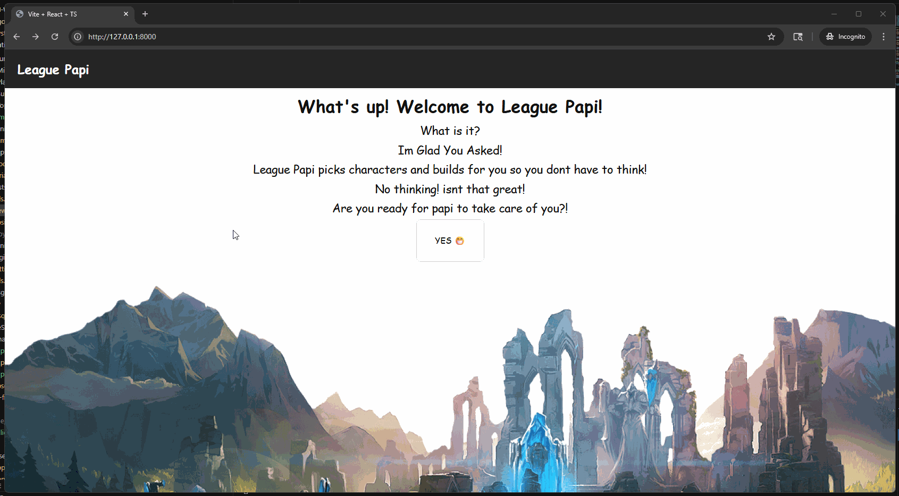

# WHAT IS THIS APP?
This app will be a league of legends Champions picker.

# What does it do?
This app will randomly select a champion to play, based on a selected role.

# How Does this work?
I will have a database with preset champions, items, skillorders, and runes the way I would play them. Upon clicking the button, it will show everything in the order I would like it as an assistnace to building my character the way I normally do it, so I dont have to think.

# Updates

6/27/2025 - Basic View Created

currently, its a django app that uses sqlite and a simple index.html view was made. I Plan to use React from now on.

6/27/2025 - Added Basic React & Docker

currently, its just the react vite template.

I also added docker. Note, had to change port in dockerfilee to the matching one in the url for react, but also add to vite.config.ts code to allow the server to talk to docker and also list port there.

6/29/2025 - WebScraped Item names and added them to database

As you can see, the items were added sucessfully. Before, I made the url /items run a function that takes all of the league items from the database, and then serializes them, returning a JSON for easier viewing and manipulation. I messed around with beautiful soup in an ipynb, and then once I grabbed what I wanted, I just made a python script without all of the print statements that scrapes from leagueoflegendswiki. If I ever want to updata the database with new items added, all I need to do is run that script and it will pull any new items and add them to the database. Next step is to scrape corresponding images, and have those display sucessfully.

7/1/2025 - webscraped item images and worked on roles page

This is the roles page right now. I scraped these small images, along with updating the previous item script to download the images of the items. The next step is to eedit the sprites to make them slightly larger, without distortion, and then format the page like the red lines in the image above. After the role page is done, I will work on grabbing all of the items, and figuring out how I should store those and rerieve them.

7/2/2025- This is what the updates pages and flow looks like right now.

7/10/2025 - FIRST PROTOTYPE DONE!!!

It has been a while, so this will be a long description. Basically, 
- I grabbed all of the pictures from the site and have python scripts to do so.
- I made models for each, so there is a table for everything needed in my database(Items, Champs, Builds, Runes)
- I downloaded django-REST api, so that I can make posts easily
- I madee the host (http:blahblahblah) the same for both my front end and backend so they can talk to each other and pass auth tokens easily.
- I needed auth tokens, so I can restrict access to POST, for only admins.
- I made the POST page, only available for admins , so if someone tries to go to that url, they cant, unless they have signed in and have cookies!
- I further added stylings and made sure pages layout works for mobile and desktop
- Roles page redirects to details page, which pull a random object and its components (runes champ etc) from the corresponding role table.
- Remade thee home page and what the site is called! I think it looks nicer!

Here is the page flow.

Here is Dynamic Page sizes.

And finnaly, here is the secure backend, that has admin login to do the post and see that page.

This was lots of work but im excited that I can take a break and call this a checkpoint of PROTOYPE 1 DONE!!!
